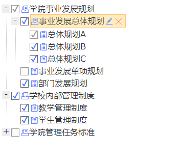

```
执行方法：(本示例仅为展示修改后的样式效果)
npm install
npm run start
127.0.0.1:8080
```
##对ztree插件做了源码修改， 主要是取消原有的雪碧背景图样式， 替换为字体图标，并可以修改整体fontSize大小.
##插件原本使用的slideDown, slideUp进行展开折叠， 但是由于和修改后的伪元素在执行动画时伪元素做的选择框有隐藏迟钝象;所以把插件中目录树折叠显示的地方修改为show hide， 在展开折叠过程中多少还是有些瑕疵，不过不是特别影响。


**修改的文件为"static\src\lib\ztree\js\jquery.ztree.all.js"**
<pre>
<code>
```
 _consts = {
      className: {
        BUTTON: "button",
        LEVEL: "level",
        ICO_LOADING: "ico_loading",
        SWITCH: "switch",
        NAME: 'node_name'
      },
      event: {
        NODECREATED: "ztree_nodeCreated",
        CLICK: "ztree_click",
        EXPAND: "ztree_expand",
        COLLAPSE: "ztree_collapse",
        ASYNC_SUCCESS: "ztree_async_success",
        ASYNC_ERROR: "ztree_async_error",
        REMOVE: "ztree_remove",
        SELECTED: "ztree_selected",
        UNSELECTED: "ztree_unselected"
      },
      id: {
        A: "_a",
        ICON: "_ico",
        SPAN: "_span",
        SWITCH: "_switch",
        UL: "_ul"
      },
      line: {
        ROOT: "root",
        ROOTS: "roots",
        CENTER: "center",
        BOTTOM: "bottom",
        NOLINE: "noline",
        LINE: "line"
      },
      folder: {
        OPEN: "open",
        CLOSE: "close",
        DOCU: "docu"
      },
      node: {
        CURSELECTED: "curSelectedNode"
      },
      usericon:{ ///////////添加了usericon属性
        //折叠状态
        CLOSE: "tree-plus",
        OPEN:"tree-minus",
        //父节点图标
         FATHSERNODE: 'iconfont icon-fuhecailiao iconfolder', //此处为添加的字体图标类名

         FATHSERNODEOPEN:'iconfont icon-fuhecailiao iconfolder', //此处为添加的字体图标类名
      
        //子节点图标
         CHILDRENNODE: "iconfont icon-changguigongzuo iconfolder", //此处为添加的字体图标类名
     
        //复选框图标
        FACHECK: "falseCheckSty",
        FACHECKHalfED: "halfCheckSty",
        FACHECKED: "fullCheckSty",
     
        //编辑图标
         EDIT: "iconfont icon-bianji iconEdit", //此处为添加的字体图标类名
        //移除图标
         REMOVE: "iconfont icon-guanbi iconRemove", //此处为添加的字体图标类名
        //增加节点图标
        ADDNODE: "fa-plus-square"
      }
    },
    ```
</code>
</pre>
线条和复选框的样式修改为使用原有的类名的基础上使用伪元素进行覆盖
**根据需要在样式中修改大小**
<pre>
<code>
```
    #treeDemo .iconfont {
    top: 7px;
    position: relative;
    }

    #treeDemo .iconEdit,
    #treeDemo .iconfolder {
        color: #3e75ff;
    }

    #treeDemo .iconRemove {
        color: #ff5168;
    }
    .checkbox_true_disable::before{
        position: absolute;
        content: "\2714";
        width: 1em;
        height: 1em;
        border: 1px solid #999;
        color: #999;
        padding: 6px 2px 0px 1px;
    }
    .checkbox_false_disable::before{
        position: absolute;
        content: "";
        width: 1em;
        height: 1em;
        border: 1px solid #999;
        color: #ccc;
        padding: 0 2px;
        box-shadow: 0 0 6px #eaeaea inset;
    }
    .checkbox_true_full::before,
    .checkbox_true_full_focus::before {
        position: absolute;
        content: "\2714";
        width: 1em;
        height: 1em;
        border: 1px solid #666;
        color: #3e75ff;
        padding: 6px 2px 0px 1px;
    }

    .checkbox_true_part::before,
    .checkbox_true_part_focus::before {
        position: absolute;
        content: "\2714";
        width: 1em;
        height: 1em;
        border: 1px solid #666;
        color: #3e75ff;
        padding: 6px 2px 0px 1px;
        box-shadow: 0 0 6px #666 inset;
    }

    .checkbox_false::before,
    .checkbox_false_full::before,
    .checkbox_false_full_focus::before {
        position: absolute;
        content: "";
        width: 1em;
        height: 1em;
        border: 1px solid #666;
        color: #3e75ff;
        padding: 0 2px;
        box-shadow: 0 0 6px #eaeaea inset;
    }

    .roots_open::before,
    .root_open::before,
    .center_open::before,
    .bottom_open::before {
        position: absolute;
        content: "-";
        width: 1em;
        height: 1em;
        text-align: center;
        background: #eee;
        padding-top: 6px;
    }

    .roots_close::before,
    .root_close::before,
    .center_close::before,
    .bottom_close::before {
        position: absolute;
        content: "+";
        width: 1em;
        height: 1em;
        text-align: center;
        background: #eee;
        padding-top: 6px;
    }

    .ztree li span.button {
        background-image: none !important;
    }

    /* 修改尺寸 */
    .ztree * {
        font-size: 16px;
    }
    .ztree li{
        line-height: 1.5em;
    }
    .ztree li a.curSelectedNode {
        height: 100%;
    }

    .ztree li span.button.chk {
        width: 1em;
        height: 1em;
    }
    .ztree li span.button.edit, .ztree li span.button.remove{
        vertical-align: middle;
    }
```
</code>
</pre>
